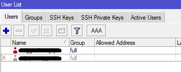

## Overview Network Technology

This network technology running 24Hour/7days in my labs and production system with harderning best practice model.

<p align="center">

</p>

### Information

Virtual Cloud Computing :
- VPS (AWS/GCP/DigitalOcean/Hostinger/Local Provider VPS) 1 CPU, 1 RAM, 30GB Storage
- Install MikroTik CHR x86 on VPS (Include license P1)
- 1 Public IP

Local Hardware (Consumer Grade) :
- Router MikroTik RB750/RB951/RB2011/CHR x86 (CHR x86 include license P1)
- PC Intel i5 Gen 10, RAM 32GB, HDD 1TB and SSD 500GB (For Production Case)
- LAN

System Open-Source Software :
- Proxmox Virtualization Environment (For Virtualizaition Host)
- MikroTik RouterOS 6.49.18 or Newer

Etc :
- Electircal system support 24/7
- Internet Broadband FTTH (Minimal Bandwidth 10MB or Higher)
- Backup GSM Internet (Optional Case)

## Network Configuration Scope

### Router Scope

MikroTik Configuration :
- Loopback IP (Support Routing OSPF, Routing BGP)
- Static IP (IP Virtualization Host, Tunnel L2TP, SSTP)
- DHCP Server (IP Virtualization Host, LAN Management)
- DHCP Client (Access Internet For Router Local)
- Tunnel SSTP (P2P OSPF Network)
- Tunnel L2TP (VPN Access)
- VLAN (Management, Production)
- Static Routing (Routing to Public IP VPS)
- Routing OSPF (Routing for Hope Router)
- Routing BGP (Routing for Private IP and VPN Access)
- Routing Filter OSPF and BGP (Accept, Discard Rules)
- Firewall NAT (Src-NAT, Dst-NAT, Access List NAT, Masquerade)
- User Management (Username, Password, Group)
- Harderning IP Services Router (Disable Port, Custom Port Services)
- DNS Over HTTPs (Cloudflare Case)

### Virtualization Scope

Proxmox Configuration :
- Disable Proxmox-Subscription
- VLAN Management
- VLAN Host Virtualization
- Harderning (Fail2ban, SSH)

## Build Router on VPS

### Setup VPS

- Order VPS (AWS/GCP/DigitalOcean/Hostinger/Local Provider VPS)
- Change type OS MikroTik CHRx86 or Ubuntu Newer (Special Case)
- Access VPS via SSH from Public IP or Console from platform

### MikroTik Running on Ubuntu VPS (Special Case)

- Access VPS via SSH from Public IP
- Update Ubuntu `apt update && apt upgrade -y`
- Install Git `apt install git -y`
- Clone Script Install MikroTik on Ubuntu VPS, Access Detail Documentation : "https://github.com/anggrdwjy/mikrotik-ubuntukvm.git"
- First Step, Access MikroTik via Winbox from Public IP
- Step two, Change New Password (Please Harderning Username Password First)
- Check and Validation License, Install License P1 or Upgrade License
- Ping 1.1.1.1 or 8.8.8.8 from MikroTik Router
- Request Time Out (RTO) Ping, Check your DNS from MikroTIk Router until Replay Response

## Configuration Router

### Step 1. MikroTik CHR on VPS

1. Harderning Username and Password (Add New Username, Group Full Admin, and Delete Default Username Admin)

<p align="center">

</p>

2. Custom Port IP Services (SSH, Winbox and Disable Port API, API-SSL, FTP, Telnet, WWW, WWW-SSL)
```
/ip service
set telnet disabled=yes
set ftp disabled=yes
set www disabled=yes
set ssh port=23452  \\ Custom Port SSH
set api disabled=yes
set winbox port=58291  \\ Custom Port Winbox
set api-ssl disabled=yes
```

3. Setup Static Routing (Set Public IP and Routing to 0.0.0.0/0)
```
/ip route
add distance=1 gateway=103.xx.yy.zzz
```

4. Setup DNS (Set 1.1.1.1, 1.0.0.1 or 8.8.8.8, 8.8.4.4)
```
/ip dns
set allow-remote-requests=yes servers=1.1.1.1,1.0.0.1,8.8.8.8,8.8.4.4
```

5. Setup VPN SSTP Tunnel (For Between Routers and Custom Port SSTP)

* Setup Profile SSTP
```
/ppp secret
add local-address=10.13.3.4 name=sstp.proxmox password=changeme profile=default-encryption remote-address=10.13.3.5 service=sstp
```

* Setup VPN SSTP
```
/interface sstp-server server
set default-profile=default-encryption enabled=yes port=49431
```

6. Setup VPN L2TP Tunnel (For VPN Access to Local Network)

* Setup Profile L2TP
```
/ppp secret
add local-address=10.13.3.0 name=vpn.l2tp1 password=changeme profile=default-encryption remote-address=10.13.3.1 service=l2tp
add local-address=10.13.3.2 name=vpn.l2tp2 password=changeme profile=default-encryption remote-address=10.13.3.3 service=l2tp
```

* Setup VPN L2TP
```
/interface l2tp-server server
set enabled=yes ipsec-secret=changemenow use-ipsec=yes
```

7. Setup Firewall NAT (Set Out Interface and SRC-NAT to Public IP)
```
/ip firewall nat
add action=src-nat chain=srcnat out-interface=ether1 to-addresses=103.xx.yy.zz
```

8. Disable Neighbor Discovery
```
/ip neighbor discovery-settings
set discover-interface-list=none protocol=""
```

9. Disable SMB Default MikroTik
```
/ip smb
set allow-guests=no
```

10. Disable Bandwidth-Server
```
/tool bandwidth-server
set authenticate=no enabled=no
```

11. Set System Identity and System Clock

* System Indentity
```
/system identity
set name=INETGW-CHRx86-VPS
```

* System Clock
```
/system clock
set time-zone-name=Asia/Jakarta
```

### Step 2. MikroTik RB2011 (Router Local)

## Baremetal Server

## Virtualization Host on Baremetal

## Testing

## Support
