## Overview Network Technology
<p align="center">
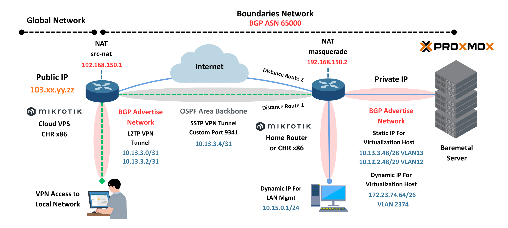
</p>

### Information
- Virtual Private Server (AWS/GCP/DigitalOcean/Hostinger/Local Provider VPS)
- Spesification VPS 1 CPU, 1 RAM, 30GB Storage Include Public IP
- OS Virtual Private Server, MikroTik RoS 6.49.xx or Newer
- RouterBoard MikroTik RB750/RB951/RB2011 or MikroTik CHR x86 (Include license P1)
- Build PC Intel i5 Gen 10, RAM 32GB, HDD 1TB and SSD 500GB
- Proxmox Virtualization Environment (For Virtualizaition Host)
- Electircal system support 24/7
- Internet Broadband FTTH (Minimal Bandwidth 10MB or Higher)

## Network Configuration Scope

#### Router MikroTik Configuration
* Basic Configuration (UserPass Management, Static Route, DNS, DHCP Server, DHCP Client)
* Firewall NAT and Address-List
* VPN Tunnel Server L2TP, SSTP and VPN Client 
* Routing OSPF and Routing Filter
* Routing BGP and Routing Filter
* Harderning
* DNS Over HTTPs

#### Proxmox Configuration
- VLAN Management
- VLAN Host Virtualization
- Harderning

## Build Router on Virtual Private Server

### Setup Virtual Private Server
- Order VPS (AWS/GCP/DigitalOcean/Hostinger/Local Provider VPS)
- Change type OS MikroTik CHRx86 or Ubuntu Newer (Special Case VPS)
- Access VPS via SSH from Public IP or Console from platform

### Install MikroTik on Ubuntu VPS (Special Case VPS)
- Access VPS via SSH from Public IP
- Update Ubuntu `apt update && apt upgrade -y`
- Install Git `apt install git -y`
- Clone Script Install MikroTik on Ubuntu VPS, Detail Documentation : "https://github.com/anggrdwjy/mikrotik-ubuntukvm.git"
- First Step, Access MikroTik via Winbox from Public IP
- Step two, Change New Password (Please Harderning Username Password First)
- Check and Validation License, Install License P1 or Upgrade License
- Ping 1.1.1.1 or 8.8.8.8 from MikroTik Router
- Request Time Out (RTO) Ping, Check your DNS from MikroTIk Router until Replay Response

## Router Configuration

### Step 1. Basic Configuration

#### A. MikroTik CHR on VPS

#### Username and Password
* Add New User
```
/user add name=user.mikrotik password=changemenow group=full
```

* Check List User
```
/user print
```

#### User Verification
<p align="left">
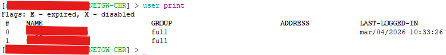
</p>

#### System Identity and System Clock
* System Indentity
```
/system identity
set name=INETGW-xxx-yy
```

* System Clock
```
/system clock
set time-zone-name=Asia/Jakarta
```

#### Clock Verification
<p align="left">
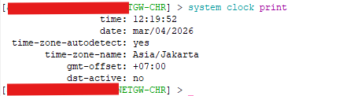
</p>

#### Static IP
```
/ip address
add address=103.xx.yy.zz/2x interface=ether1 network=103.xx.yy.zz
```

#### Routing Static
```
/ip route
add distance=1 gateway=103.xx.yy.zz
```

#### Route Static Verification
<p align="left">
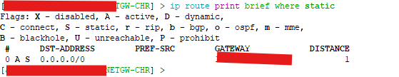
</p>

#### DNS Static
```
/ip dns
set allow-remote-requests=yes servers=1.1.1.1,1.0.0.1,8.8.8.8,8.8.4.4
```

#### DNS Verification
<p align="left">
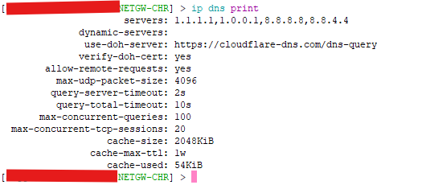
</p>

#### B. MikroTik RB2011 (Router Local)

#### Username and Password
* Add New User
```
/user add name=user.mikrotikrb password=changemenow group=full
```

* Check List User
```
/user print
```

#### System Identity and System Clock
* System Indentity
```
/system identity
set name=ROUTECORE-RB2011-CPE
```

* System Clock
```
/system clock
set time-zone-name=Asia/Jakarta
```

#### DHCP Client
```
/ip dhcp-client
add default-route-distance=2 disabled=no interface=ether1
```

#### DHCP Client Verification
<p align="left">
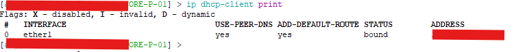
</p>

#### VLAN Management
```
/interface vlan
add interface=ether2 name=vlan12 vlan-id=12
add interface=ether2 name=vlan13 vlan-id=13
add interface=ether2 name=vlan2374 vlan-id=2374
```

#### Static IP
```
/ip address
add address=172.23.74.65/26 interface=vlan2374 network=172.23.74.64
add address=192.168.1.2/24 interface=ether1 network=192.168.1.0
add address=10.13.3.49/28 interface=vlan13 network=10.13.3.48
add address=10.12.2.49/29 interface=vlan12 network=10.12.2.48
```

#### DNS Static
```
/ip dns
set allow-remote-requests=yes servers=1.1.1.1,1.0.0.1,8.8.8.8,8.8.4.4
```

#### DNS Verification
<p align="left">
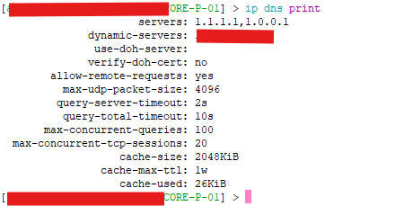
</p>

#### DHCP Server
* Set IP Pool
```
/ip pool
add name=dhcp_pool1 ranges=172.23.74.66-172.23.74.126
```

* Set DHCP Server
```
/ip dhcp-server
add address-pool=dhcp_pool1 disabled=no interface=vlan2374 name=dhcp1
```

* Set DHCP Server Network
```
/ip dhcp-server network
add address=172.23.74.64/26 dns-server=1.1.1.1,1.0.0.1 gateway=172.23.74.65
```

### Step 2. Firewall NAT

#### A. MikroTik CHR on VPS

#### Firewall NAT
```
/ip firewall nat
add action=src-nat chain=srcnat out-interface=ether1 src-address-list=access-list\
to-addresses=103.xx.yy.zz
```

#### Firewall Address-list
```
/ip firewall address-list
add address=10.13.3.0/31 list=access-list
add address=10.13.3.2/31 list=access-list
add address=10.13.3.48/28 list=access-list
add address=10.12.2.48/29 list=access-list
add address=172.23.74.64/26 list=access-list
```

#### Access-List Verification
<p align="left">
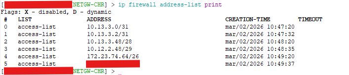
</p>

#### B. MikroTik RB2011 (Router Local)

#### Firewall NAT
```
/ip firewall nat
add action=masquerade chain=srcnat out-interface=ether1 src-address-list=access-list
```

#### Firewall Address-list
```
/ip firewall address-list
add address=10.13.3.48/28 list=access-list
add address=10.12.2.48/29 list=access-list
add address=172.23.74.64/26 list=access-list
add address=10.15.0.0/24 list=access-list
```

#### Access-List Verification
<p align="left">
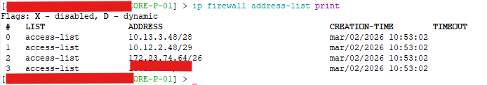
</p>

### Step 3. VPN Tunnel SSTP and L2TP

#### A. MikroTik CHR on VPS

#### VPN Server SSTP
* Setup Profile SSTP
```
/ppp secret
add local-address=10.13.3.4 name=sstp.proxmox password=changeme profile=default-encryption\
remote-address=10.13.3.5 service=sstp
```

* Setup VPN SSTP
```
/interface sstp-server server
set default-profile=default-encryption enabled=yes port=49431
```

#### VPN Server L2TP
* Setup Profile L2TP
```
/ppp secret
add local-address=10.13.3.0 name=vpn.l2tp1 password=changeme profile=default-encryption\
remote-address=10.13.3.1 service=l2tp
add local-address=10.13.3.2 name=vpn.l2tp2 password=changeme profile=default-encryption\
remote-address=10.13.3.3 service=l2tp
```

* Setup VPN L2TP
```
/interface l2tp-server server
set enabled=yes ipsec-secret=changemenow use-ipsec=yes
```

#### VPN Server Verification
<p align="left">
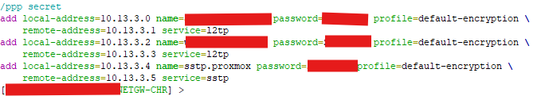
</p>

#### B. MikroTik RB2011 (Router Local)

#### VPN Client SSTP
```
/interface sstp-client
add add-default-route=yes connect-to=103.xx.yy.zz:49341 disabled=no http-proxy=vv.xx.yy.zz:49341\
name=sstp-out1 password=changemenow profile=default-encryption user=sstp.proxmox
```

#### SSTP Client Verification
<p align="left">
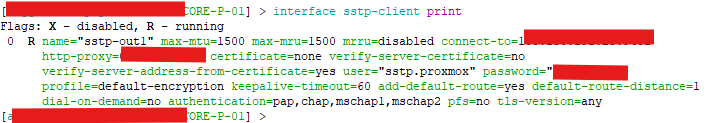
</p>

#### C. Windows L2TP Client (VPN Access)

#### L2TP Client Verification
<p align="left">
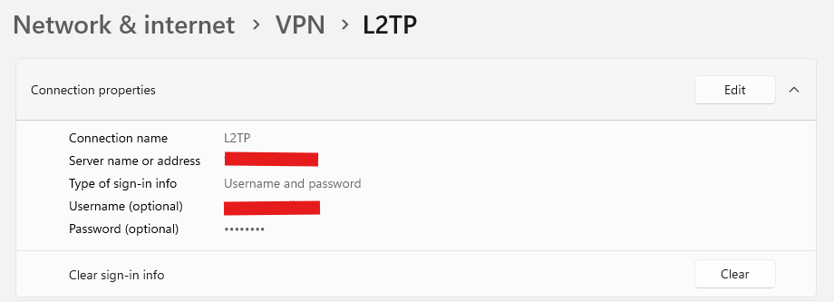
</p>

### Step 4. Routing OSPF

#### A. MikroTik CHR on VPS

#### Set Loopback
```
/interface bridge
add name=Lo0
```

#### Set IP Loopback
```
/ip address
add address=192.168.150.1 interface=Lo0 network=192.168.150.1
```

#### Set OSPF Instance
```
/routing ospf instance
set [ find default=yes ] router-id=192.168.150.1
```

#### Set OSPF Network Advertise
```
/routing ospf network
add area=backbone network=10.13.3.4/31
add area=backbone network=192.168.150.1/32
```

#### Set OSPF Routing Filter
```
/routing filter
add action=accept chain=ospf-in prefix-length=31-32
add action=discard chain=ospf-in
```

#### OSPF Verification
<p align="left">
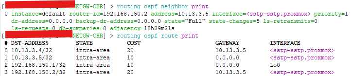
</p>

#### B. MikroTik RB2011 (Router Local)

#### Set Loopback
```
/interface bridge
add name=Lo0
```

#### Set IP Loopback
```
/ip address
add address=192.168.150.2 interface=Lo0 network=192.168.150.2
```

#### Set OSPF Instance
```
/routing ospf instance
set [ find default=yes ] router-id=192.168.150.2
```

#### Set OSPF Network Advertise
```
/routing ospf network
add area=backbone network=10.13.3.4/31
add area=backbone network=192.168.150.2/32
```

#### Set OSPF Routing Filter
```
/routing filter
add action=accept chain=ospf-in prefix-length=31-32
add action=discard chain=ospf-in
```

#### OSPF Verification
<p align="left">
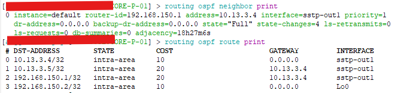
</p>

### Step 5. Routing BGP

#### A. MikroTik CHR on VPS

#### Set BGP Routing Filter
```
/routing filter
add action=accept chain=bgp-out prefix=10.13.3.0/31 prefix-length=31
add action=accept chain=bgp-out prefix=10.13.3.2/31 prefix-length=31
add action=discard chain=bgp-out
```

#### Set BGP Instance
```
/routing bgp instance
set default as=65000 client-to-client-reflection=no router-id=192.168.150.1
```

#### Set BGP Peer
```
/routing bgp peer
add name=peer-ROUTECORE out-filter=bgp-out remote-address=192.168.150.2 remote-as=65000\
tcp-md5-key=changemenow update-source=Lo0
```

#### Set BGP Network Advertise
```
/routing bgp network
add network=10.13.3.0/31 synchronize=no
add network=10.13.3.2/31 synchronize=no
```

#### BGP Verification
<p align="left">
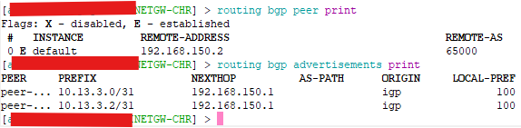
</p>

#### B. MikroTik RB2011 (Router Local)

#### Set BGP Routing Filter
```
/routing filter
add action=accept chain=bgp-out prefix=10.13.3.0/31 prefix-length=31
add action=accept chain=bgp-out prefix=10.13.3.2/31 prefix-length=31
add action=discard chain=bgp-out
```

#### Set BGP Instance
```
/routing bgp instance
set default as=65000 client-to-client-reflection=no router-id=192.168.150.
```

#### Set BGP Peer
```
/routing bgp peer
add name=peer-INETGW out-filter=bgp-out remote-address=192.168.150.1 remote-as=65000\
tcp-md5-key=changemenow update-source=Lo0
```

#### Set BGP Network Advertise
```
/routing bgp network
add network=10.13.3.48/28 synchronize=no
add network=10.12.2.48/29 synchronize=no
add network=172.23.74.64/26 synchronize=no
add network=10.15.0.0/24 synchronize=no
```

#### BGP Verification
<p align="left">
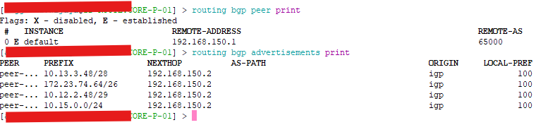
</p>

### Step 6. Harderning

#### MikroTik CHR on VPS and MikroTik RB2011

#### Custom Port IP Services
```
/ip service
set telnet disabled=yes
set ftp disabled=yes
set www disabled=yes
set ssh port=23452  \\ Custom Port SSH
set api disabled=yes
set winbox port=58291  \\ Custom Port Winbox
set api-ssl disabled=yes
```

#### Delete Default Admin
```
/user remove admin
```

#### Disable Neighbor Discovery
```
/ip neighbor discovery-settings
set discover-interface-list=none protocol=""
```

#### Disable SMB Default
```
/ip smb
set allow-guests=no
```

#### Disable Bandwidth-Server
```
/tool bandwidth-server
set authenticate=no enabled=no
```

#### Port Scanning via NMAP
<p align="left">
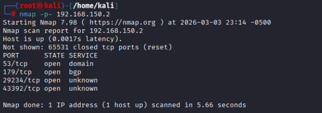
</p>

#### SSH Testing (Default User MikroTik)
<p align="left">
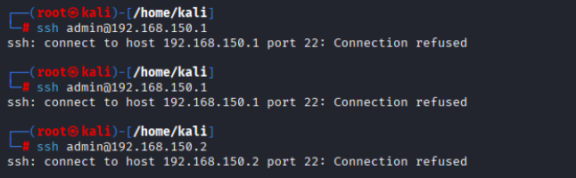
</p>


### Step 7. DNS over HTTPs

#### Import Cert
```
/tool fetch url=https://curl.se/ca/cacert.pem
/certificate import file-name=cacert.pem passphrase=""
/file remove cacert.pem
```

#### DNS Configuration
```
/ip dns
set use-doh-server=https://cloudflare-dns.com/dns-query verify-doh-cert=yes
/ip dns static
add address=104.16.248.249 name=cloudflare-dns.com
add address=104.16.249.249 name=cloudflare-dns.com
```

#### Firewall Forwarding to Cloudflare
```
/ip firewall nat
add action=dst-nat chain=dstnat dst-port=53 protocol=tcp to-addresses=1.1.1.1 to-ports=53
add action=dst-nat chain=dstnat dst-port=53 protocol=udp to-addresses=1.1.1.1 to-ports=53
```

#### Check DNS Leak
<p align="left">
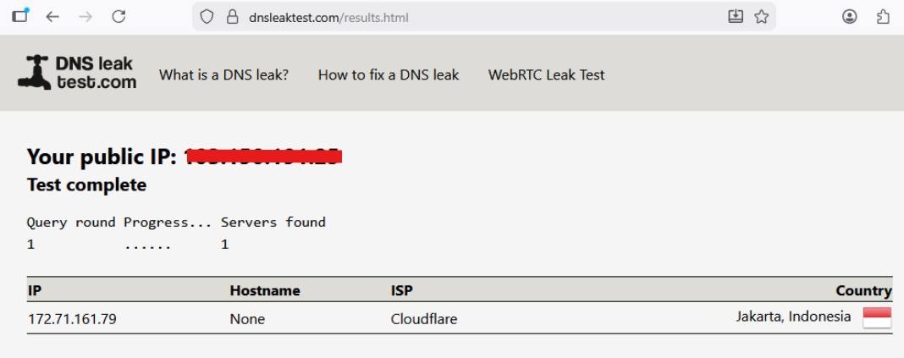
</p>

#### Check DNS Linux
<p align="left">

</p>

#### Check DNS Windows
<p align="left">
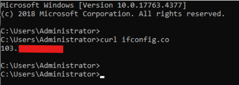
</p>

## Configuration Proxmox

### A. Static IP and VLAN Configuration Proxmox

#### IP Configuration Proxmox, Directory /etc/network/interfaces
```
auto lo
iface lo inet loopback

auto enp3s0
iface enp3s0 inet manual

auto vmbr0
iface vmbr0 inet manual
        bridge-ports enp3s0
        bridge-stp off
        bridge-fd 0
        bridge-vlan-aware yes
        bridge-vids 2-4094

auto vlan13
iface vlan13 inet static
        address 10.13.3.50/28
        gateway 10.13.3.49
        vlan-raw-device vmbr0
```

#### Verification
<p align="left">
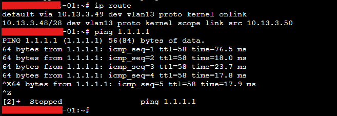
</p>

### B. VLAN Virtual-Machine Testing

#### Test 1. Static IP LXC Container
<p align="left">
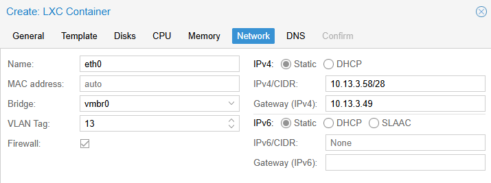
</p>

#### Verification LXC Container
<p align="left">
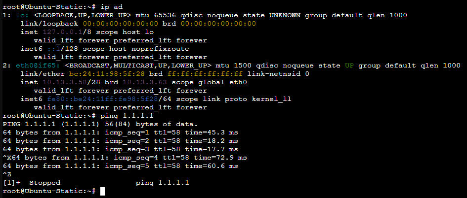
</p>

#### Test 2. DHCP LXC Container
<p align="left">
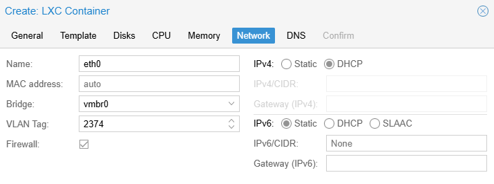
</p>

#### Verification LXC Container
<p align="left">
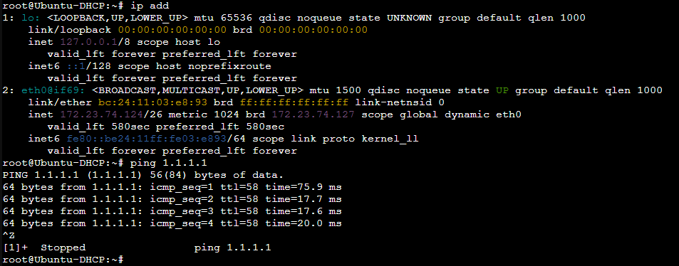
</p>

#### Test 3. Static IP Kernel-Based Virtual Machine (KVM)

#### Configuration KVM Linux
<p align="left">
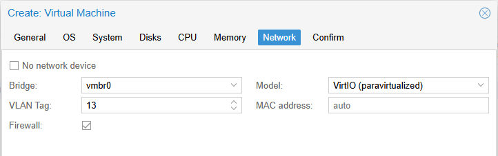
</p>

#### Configuration KVM Windows
<p align="left">
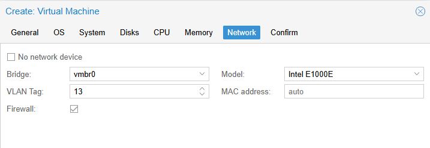
</p>

#### Verification KVM Linux
<p align="left">
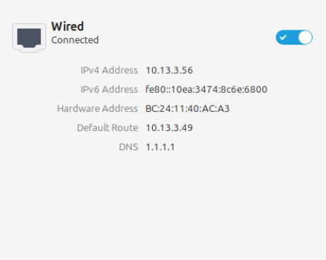
</p>

#### Verification KVM Windows
<p align="left">
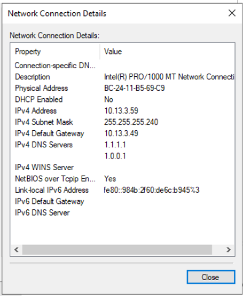
</p>

#### Test 4. DHCP IP Kernel-Based Virtual Machine (KVM)

#### Configuration KVM Linux
<p align="left">
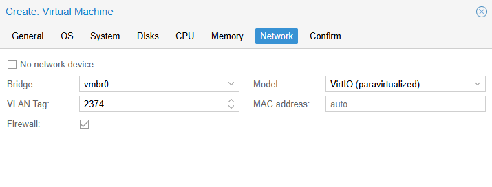
</p>

#### Configuration KVM Windows
<p align="left">
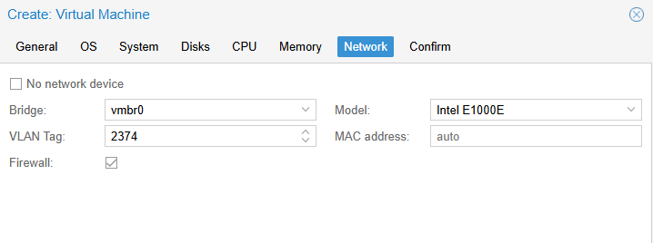
</p>

#### Verification KVM Linux
<p align="left">
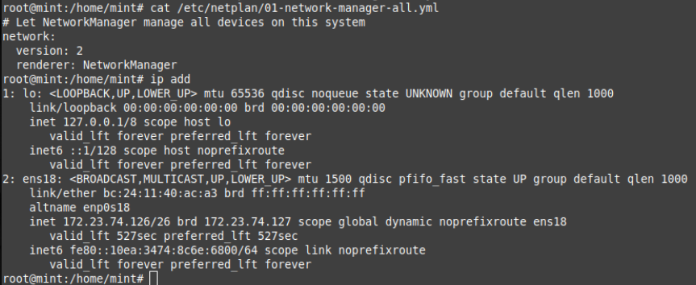
</p>

#### Verification KVM Windows
<p align="left">
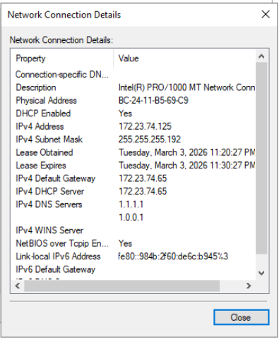
</p>

### C. Harderning

#### Custom Port SSH (Default 22)

* Edit Port SSH, /etc/ssh/sshd_config
```
Include /etc/ssh/sshd_config.d/*.conf

Port 21112
#AddressFamily any
#ListenAddress 0.0.0.0
#ListenAddress ::
```

* Restart SSH
```
systemctl restart sshd
```

* SSH Status
```
root@awc-east-01:~# systemctl status sshd
● ssh.service - OpenBSD Secure Shell server
     Loaded: loaded (/lib/systemd/system/ssh.service; enabled; preset: enabled)
     Active: active (running) since Fri 2024-10-11 00:42:32 WIB; 1 year 4 months ago
       Docs: man:sshd(8)
             man:sshd_config(5)
    Process: 815 ExecStartPre=/usr/sbin/sshd -t (code=exited, status=0/SUCCESS)
   Main PID: 830 (sshd)
      Tasks: 1 (limit: 28551)
     Memory: 2.7M
        CPU: 16ms
     CGroup: /system.slice/ssh.service
             └─830 "sshd: /usr/sbin/sshd -D [listener] 0 of 10-100 startups"

Oct 11 00:42:32 awc-east-01.local systemd[1]: Starting ssh.service - OpenBSD Secure Shell server...
Oct 11 00:42:32 awc-east-01.local sshd[830]: Server listening on 0.0.0.0 port 21112.
Oct 11 00:42:32 awc-east-01.local sshd[830]: Server listening on :: port 21112.
Oct 11 00:42:32 awc-east-01.local systemd[1]: Started ssh.service - OpenBSD Secure Shell server.
root@awc-east-01:~# 
```

#### Install Fail2ban

* Installing Fail2ban
```
root@pve:~# git clone https://github.com/anggrdwjy/proxmox-fail2ban.git
Cloning into 'proxmox-fail2ban'...
remote: Enumerating objects: 43, done.
remote: Counting objects: 100% (43/43), done.
remote: Compressing objects: 100% (40/40), done.
remote: Total 43 (delta 7), reused 0 (delta 0), pack-reused 0 (from 0)
Receiving objects: 100% (43/43), 503.65 KiB | 1.36 MiB/s, done.
Resolving deltas: 100% (7/7), done.
root@pve:~# cd proxmox-fail2ban
root@pve:~/proxmox-fail2ban# chmod -R 777 *
root@pve:~/proxmox-fail2ban# ls -l
total 20
drwxrwxrwx 2 root root 4096 Feb 28 16:45 img
-rwxrwxrwx 1 root root  223 Feb 28 16:45 jail.local
-rwxrwxrwx 1 root root  108 Feb 28 16:45 proxmox.conf
-rwxrwxrwx 1 root root 1894 Feb 28 16:45 README.md
-rwxrwxrwx 1 root root  341 Feb 28 16:45 setup-fail2ban.sh
root@pve:~/proxmox-fail2ban# 
```

* Running Program
```
root@pve:~/proxmox-fail2ban# ./setup-fail2ban.sh 
Get:1 http://security.debian.org bookworm-security InRelease [48.0 kB]
Hit:2 http://ftp.debian.org/debian bookworm InRelease                                        
Get:3 http://ftp.debian.org/debian bookworm-updates InRelease [55.4 kB]
Hit:4 http://download.proxmox.com/debian/ceph-quincy bookworm InRelease
Hit:5 http://download.proxmox.com/debian/pve bookworm InRelease
Fetched 103 kB in 2s (64.0 kB/s)
Reading package lists... Done
Building dependency tree... Done
Reading state information... Done
230 packages can be upgraded. Run 'apt list --upgradable' to see them.
Reading package lists... Done
Building dependency tree... Done
Reading state information... Done
The following additional packages will be installed:
  python3-pyinotify whois
Suggested packages:
  system-log-daemon monit python-pyinotify-doc
The following NEW packages will be installed:
  fail2ban python3-pyinotify whois
0 upgraded, 3 newly installed, 0 to remove and 230 not upgraded.
Need to get 549 kB of archives.
```

Detail Documentation : https://github.com/anggrdwjy/proxmox-fail2ban

## Support

* [:octocat: Follow me on GitHub](https://github.com/anggrdwjy)
* [🔔 Subscribe me on Youtube](https://www.youtube.com/@anggarda.wijaya)
  
#### Bug

Please open an issue on GitHub with as much information as possible if you found a bug.
* Your Proxmox and Fail2ban Version
* All the logs and message outputted
* etc
